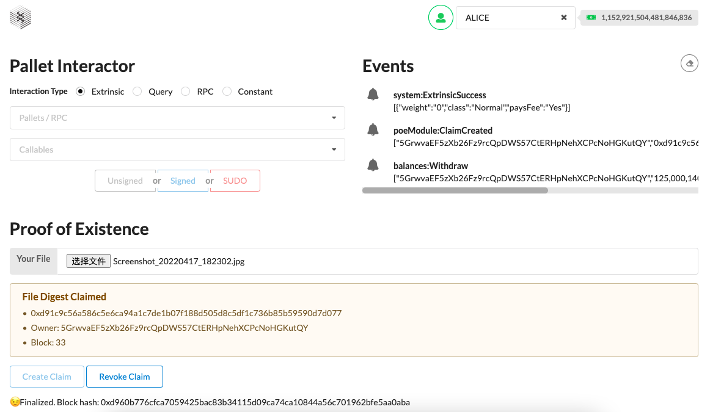

# 创建存证

### 构建辅助函数
```Rust
impl<T: Config> Pallet<T> {

	pub fn add_claim(
		account_id: &T::AccountId,
        proof: &BoundedVec<u8, T::MaxBytesInHash>,
	) -> Result<(), Error<T>> {
		let current_block = <frame_system::Pallet<T>>::block_number();
		Proofs::<T>::insert(proof, (account_id, current_block));
		Ok(())
	}
}
```

### 创建存证
```Rust
#[pallet::call]
impl<T: Config> Pallet<T> {
    #[pallet::weight(0)]
    pub fn create_claim(
        origin: OriginFor<T>,
        proof: BoundedVec<u8, T::MaxBytesInHash>,
    ) -> DispatchResult {
        let sender = ensure_signed(origin)?;
        ensure!(!Proofs::<T>::contains_key(&proof), Error::<T>::ProofAlreadyClaimed);
		Self::add_claim(&sender, &proof)?;
        Self::deposit_event(Event::ClaimCreated(sender, proof));		
        Ok(())
    }
}
```
### 运行效果


# 撤销存证

### 构建辅助函数
```Rust
impl<T: Config> Pallet<T> {

	pub fn remove_claim(
		account_id: &T::AccountId,
        proof: &BoundedVec<u8, T::MaxBytesInHash>,
	) -> Result<(), Error<T>> {
	  	ensure!(Proofs::<T>::contains_key(proof), Error::<T>::NoSuchProof);
	  	let (owner, _) = Proofs::<T>::get(proof).expect("All proofs must have an owner!");
		ensure!(*account_id == owner, Error::<T>::NotProofOwner);
		Proofs::<T>::remove(proof);
		Ok(())
	}
}
```
### 撤销存证

```Rust
#[pallet::call]
impl<T: Config> Pallet<T> {
    #[pallet::weight(0)]
    pub fn revoke_claim(
        origin: OriginFor<T>,
        proof: BoundedVec<u8, T::MaxBytesInHash>,
    ) -> DispatchResult {
        let sender = ensure_signed(origin)?;
		Self::remove_claim(&sender, &proof)?;
        Self::deposit_event(Event::ClaimRevoked(sender, proof));
        Ok(())
    }
}
```

### 运行效果


# 转移存证

```Rust
#[pallet::call]
impl<T: Config> Pallet<T> {
	#[pallet::weight(0)]
	pub fn transfer_claim(
		origin: OriginFor<T>,
		to: T::AccountId,
        proof: BoundedVec<u8, T::MaxBytesInHash>,
	) -> DispatchResult {
		let from = ensure_signed(origin)?;
		ensure!(from != to, <Error<T>>::TransferToSelf);
		Self::remove_claim(&from, &proof)?;
		Self::add_claim(&to, &proof)?;
		Self::deposit_event(Event::ClaimTransferred(from, to, proof));
		Ok(())
	}
}
```

没有前端对应页面